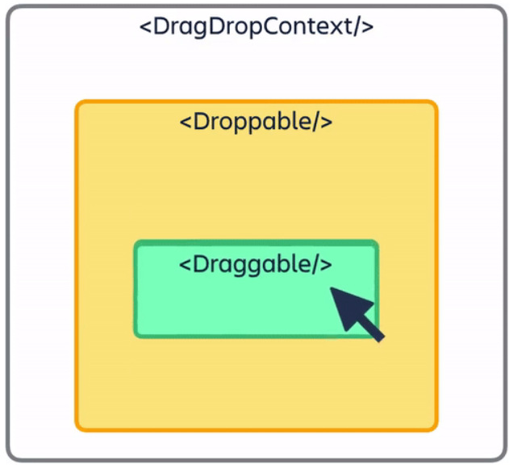

Tauri est une boîte à outils qui aide les développeurs à créer des applications pour les principales plates-formes de bureau, en utilisant pratiquement n'importe quel framework frontal existant. Le noyau est construit avec Rust et le CLI exploite Node.js, faisant de Tauri une approche véritablement polyglotte pour créer et maintenir de superbes applications. [Source](https://tauri.app/fr/about/intro/)

## Comment fonctionne Tauri ?

Tauri fonctionne en utilisant une architecture hybride, combinant une interface utilisateur basée sur le web avec un backend natif. L'interface utilisateur est construite à l'aide des technologies web habituelles, tandis que le backend est écrit en utilisant un langage de programmation natif, tel que Rust.

Voici les principaux composants de Tauri :

1. **Frontend** : L'interface utilisateur de votre application peut etre développée en utilisant les technologies web les plus connuent comme par exemple HTML, CSS et JavaScript. Vous pouvez utiliser des frameworks web populaires tels que React, Vuejs, Angular et bien d'autre, pour construire l'interface de votre application.

2. **Backend natif** : Tauri utilise un backend natif pour accéder aux fonctionnalités système et fournir une interaction avec le système d'exploitation. Le backend est développé en Rust, un langage de programmation rapide et sécurisé.

3. **Empaquetage de l'application** : Une fois que vous avez développé votre application Tauri, vous pouvez l'emballer dans un exécutable natif pour chaque plateforme cible (Windows, macOS, Linux). Cela signifie que votre application sera distribuée et exécutée comme une application de bureau native, bénéficiant ainsi des performances et des fonctionnalités spécifiques au système d'exploitation.

## Avantages de Tauri

- **Développement multiplateforme**

- **Performance élevée**

- **Accès complet aux fonctionnalités du système d'exploitation** 

- **Utilisation de technologies web familières**

- **Emballage facile de l'application**

## Conclusion - Tauri

Tauri est un framework puissant pour le développement d'applications de bureau multiplateformes en utilisant des technologies web. Il combine l'interface utilisateur web avec un backend natif pour offrir des performances élevées et un accès complet aux fonctionnalités du système d'exploitation. En utilisant Tauri, vous pouvez développer des applications de bureau natives et performantes en utilisant vos compétences en développement web.


# Comment lancer cette application

Ce projet est une application Tauri utilisant React comme framework de développement.

## Prérequis

Assurez-vous d'avoir les éléments suivants installés sur votre machine :
- [Node.js](https://nodejs.org) (version 14 ou supérieure)
- [npm](https://www.npmjs.com/get-npm)

## Installation

Suivez les étapes ci-dessous pour installer et exécuter l'application localement :

1. Clonez ce dépôt GitHub :

```bash
git clone https://github.com/dyzzorka/Trellow-app.git
cd Trellow-app
```

2. Installez les dépendances du projet :

```bash
npm install
```

3. Build l'application React :

```bash
npm run build
```

4. Générez les fichiers nécessaires à Tauri :

```bash
npm run tauri init
```

5. Démarrez l'application en mode développement :

```bash
npm run tauri dev
```

Cela lancera l'application Tauri avec React en utilisant le mode de développement.

6. Pour créer une version de production de l'application :

```bash
npm run tauri build
```

Cette commande générera une version de l'application prête à être déployée.

si vous avez un probléme vous pouvez vous referencer a la [documentation officielle des prérequies](https://tauri.app/v1/guides/getting-started/prerequisites/)

## Configuration

Le fichier de configuration principal de Tauri se trouve dans le répertoire `src-tauri/tauri.conf.js`. Vous pouvez y modifier différents paramètres pour adapter votre application.

Pour plus de détails sur la configuration de Tauri, vous pouvez consulter la [documentation officielle de Tauri](https://tauri.studio/docs/getting-started/intro).


## Fonctionnalités 

Concernant la partie React, nous allons vous présenter les librairies  principales de notre application. 

### Styled components

Les styled components sont une librairie qui permet de créer des composants de style personnalisé. C'est une façon de faire du style avec React. Le principe ? Faire un composant avec les styled components permet de :

- Décomposer les composants et créer de l'atomicité (réduire les composants au plus petit afin de faciliter la compréhension et la maintenabilité du code).
- Effectuer du style SCSS ou CSS pour chaque composant.
- Effectuer du code via les attributs.
- Éviter la répétition du code.

Présentons un exemple. Dans notre cas nous aimerions créer un style de bouton de même style mais de couleur différente en fonction de la situation. Créons le styled components : 
```tsx
import styled from "styled-components";

export const Button = styled.button`
margin-top: 20px;
color: ${props=>props.color};
border: 1px solid grey ;
width: 100%;
border-radius : 1vw;
&:hover{
    cursor: pointer;
}
`
```
Dans le code ci dessous, nous créeons un style component de type bouton avec `export const Button = styled.button`. Pour bien montrer le fait que nous pouvons interagir avec les données de style nous récupérons les propriétés via `color: ${props=>props.color}`. Nous apppliquons donc la couleur passée en propriété à l'attribut "color"

Pour appeler notre composant stylisé, nous devrions faire comme ceci 
```tsx
// Import du composant
import { AddCard } from './styles/atoms/Button'

const Home = () => {
    return (
        <div className="container" id="home-container">
            {/* Appel du composant bouton avec le paramètre blue ou red ansi que le text du bouton */}
            <Button color="blue">Mon Bouton 1</Button>
            <Button color="red">Mon Bouton 2</Button>
        </div>
    )
}

```
Et voilà vous savez utiliser les styled components. Pour en savoir plus rendez-vous sur https://styled-components.com/

### React-beautiful-dnd

Concernant cette librairie, elle permet de faire du "drag and drop" de card. Elle fonctionne comme ceci 

Le composant DragDropContext est le contexte de drag and drop, cela permet d'initialiser la zone de drag and drop. Le composant Droppable est quand à lui la colonne ou toutes les cards seront déplaçable. Le composant Draggable sont quand à elle les cards qui seront déplaçable. Vous pouvez ainsi monter vos composants (comme par exemple les styled componants vu juste au-dessus) à l'intérieur de ces composants-ci afin de faire une interface. Concernant toutes les spécificités, je vous invite à aller regarder la doc car ce package est assez complexe à mettre en oeuvre et très complet https://www.npmjs.com/package/react-beautiful-dnd

__Attention :__ Á l'heure ou j'écris ceci la librairie n'est pas compatible avec le strict-mode de React et cela rend le package inutilisable avec celui-ci d'activé.